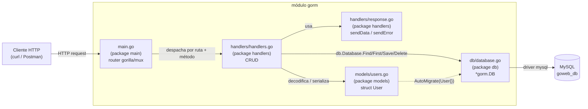
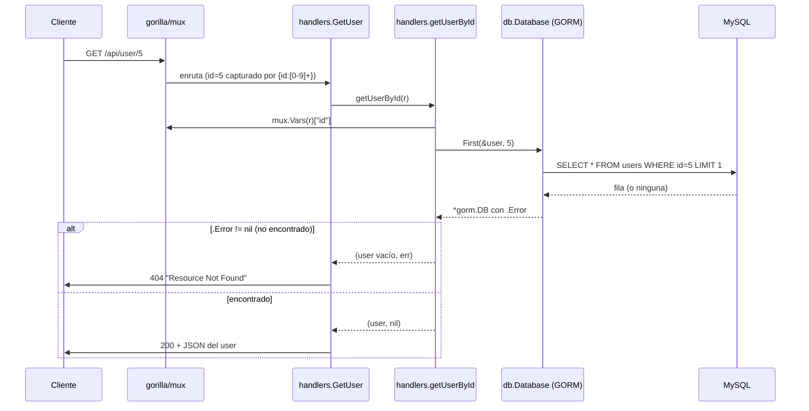
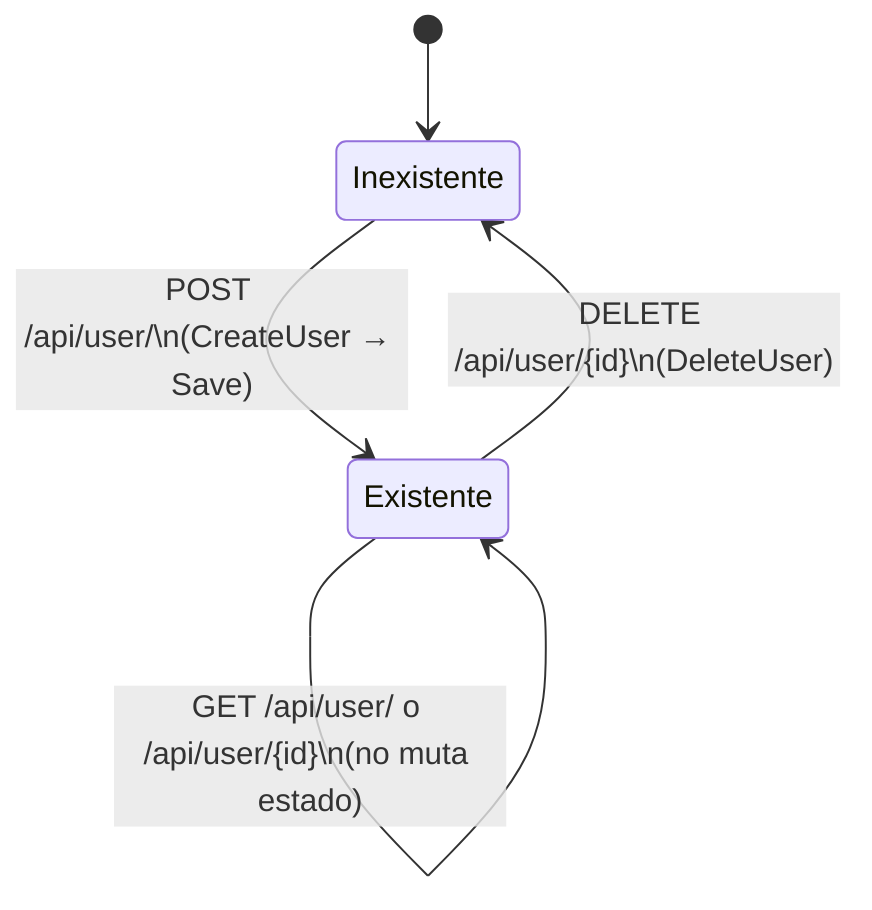

# Bitácora de desarrollo — `06-api-rest-orm`

Esta es una bitácora, no un manual de referencia: contamos el proyecto en el orden en que lo construimos, entrada por entrada, encadenando cada pieza con lo que ya teníamos antes de darle el siguiente paso.

## Índice

1. [Qué construimos y por qué](#1-qué-construimos-y-por-qué)
2. [Stack tecnológico: las decisiones que tomamos](#2-stack-tecnológico-las-decisiones-que-tomamos)
3. [Arquitectura](#3-arquitectura)
4. [Árbol de carpetas final](#4-árbol-de-carpetas-final)
5. [Construcción paso a paso](#5-construcción-paso-a-paso)
   - [5.1 go.mod: arrancamos el módulo](#51-gomod-arrancamos-el-módulo)
   - [5.2 db/database.go: la conexión a MySQL](#52-dbdatabasego-la-conexión-a-mysql)
   - [5.3 models/users.go: el modelo User](#53-modelsusersgo-el-modelo-user)
   - [5.4 handlers/response.go: cómo respondemos](#54-handlersresponsego-cómo-respondemos)
   - [5.5 handlers/handlers.go: el CRUD](#55-handlershandlersgo-el-crud)
   - [5.6 main.go: levantamos el router](#56-maingo-levantamos-el-router)
   - [5.7 Migración a Go 1.26.5](#57-migración-a-go-1265)
6. [Cómo levantar el proyecto hoy](#6-cómo-levantar-el-proyecto-hoy)
7. [Patrones aplicados y pendientes](#7-patrones-aplicados-y-pendientes)
8. [Buenas prácticas: aplicadas y faltantes](#8-buenas-prácticas-aplicadas-y-faltantes)
9. [Seguridad](#9-seguridad)
10. [Testing](#10-testing)
11. [Roadmap / pendientes](#11-roadmap--pendientes)
12. [Referencias](#12-referencias)

---

## 1. Qué construimos y por qué

Construimos una API REST mínima para gestionar un único recurso, `User`, como ejercicio del curso "Desarrollo web con Go" (`ejercicios-goweb`). Es el sexto ejercicio de la serie (`06-api-rest-orm`), y su objetivo puntual es dar el salto respecto al ejercicio anterior (`05-api-rest`, que probablemente usaba SQL a mano o un mapeo manual): aquí introducimos un **ORM** (GORM) para dejar de escribir `SELECT`/`INSERT`/`UPDATE`/`DELETE` a mano y trabajar contra structs de Go.

El alcance que nos propusimos es deliberadamente chico:

- Cuatro operaciones CRUD sobre `User`: listar, obtener uno, crear, actualizar, borrar.
- Persistencia en MySQL a través de GORM.
- Enrutamiento HTTP con `gorilla/mux`.

Dejamos fuera **a propósito**, porque no era el objetivo de este ejercicio puntual:

- Autenticación y autorización (no hay login, no hay tokens, cualquiera puede pegarle a cualquier endpoint).
- Validación de entrada (no chequeamos formato de email, longitud de password, campos obligatorios).
- Hashing de contraseñas (se guardan tal cual llegan en el JSON).
- Tests automatizados.
- Configuración por variables de entorno (el DSN de MySQL está *hardcodeado*).

Como vamos a ver en la sección de [seguridad](#9-seguridad), varias de estas omisiones dejan de ser aceptables el día que este código deje de ser un ejercicio de curso.

## 2. Stack tecnológico: las decisiones que tomamos

- **Go 1.26.5** como lenguaje y runtime. El módulo arrancó en `go 1.17` (la versión disponible cuando se escribió originalmente el curso) y lo migramos a `go 1.26.5` como parte de esta misma bitácora ([ver 5.7](#57-migración-a-go-1265)); no hubo que tocar código, el proyecto es lo bastante simple como para no depender de ninguna feature de lenguaje intermedia.
- **`gorilla/mux`** en vez del `net/http.ServeMux` de la librería estándar, porque necesitamos rutas con parámetros tipados (`/api/user/{id:[0-9]+}`) y despachar por método HTTP sobre la misma ruta (`GET` y `POST` conviven en `/api/user/`). El `ServeMux` de la stdlib en la versión de Go con la que arrancó este ejercicio (1.17) no soportaba nada de esto.
- **GORM** (`gorm.io/gorm` + `gorm.io/driver/mysql`) como ORM, para no escribir SQL a mano y para tener migraciones de esquema (`AutoMigrate`) a partir del struct `User`. Es justamente lo que distingue a este ejercicio (`api-rest-orm`) del anterior (`api-rest`).
- **MySQL** como base de datos, consistente con el resto de ejercicios del curso que ya tocan bases de datos (`04-go-mysql`).
- **JSON** como formato de intercambio, vía `encoding/json` de la librería estándar — no incorporamos ninguna librería externa de serialización porque la estándar alcanza para un CRUD simple.

No evaluamos alternativas dentro de este ejercicio (no es una decisión de arquitectura de producción, es un ejercicio de curso), pero las anotamos porque son las que determinan cómo está armado todo lo demás.

## 3. Arquitectura

Antes de escribir la primera línea de código ya teníamos claro que el proyecto iba a tener tres capas: acceso a datos (`db`), modelo (`models`) y HTTP (`handlers` + `main`). Así es como quedaron conectadas:



El flujo principal (traer un usuario por id) se ve así en secuencia:



Y el ciclo de vida del recurso `User` a través de los cuatro endpoints, visto como estados:



## 4. Árbol de carpetas final

```
06-api-rest-orm/
├── go.mod
├── go.sum
├── main.go                 # package main — arma el router y arranca el servidor
├── db/
│   └── database.go         # package db — conexión GORM a MySQL
├── models/
│   └── users.go            # package models — struct User + AutoMigrate
├── handlers/
│   ├── handlers.go         # package handlers — CRUD (GetUsers, GetUser, CreateUser, UpdateUser, DeleteUser)
│   └── response.go         # package handlers — sendData / sendError
├── docs/
│   └── GUIA_DESARROLLO.md  # este documento
└── tmp/
    └── runner-build        # binario compilado, ver nota en §8
```

## 5. Construcción paso a paso

### 5.1 go.mod: arrancamos el módulo

Lo primero es siempre el módulo. Lo nombramos `gorm` — el mismo nombre que la librería ORM que vamos a importar más adelante (`gorm.io/gorm`), lo cual en un primer vistazo puede confundir, pero no genera ningún conflicto real porque Go resuelve importaciones por *path* completo, no por el nombre corto del módulo.

📘 **Concepto de Go:** el nombre de un módulo (`module gorm` en la primera línea de `go.mod`) es solo el prefijo que usan los paquetes internos del propio proyecto para importarse entre sí (por eso `models/users.go` importa `"gorm/db"`). No tiene que coincidir con ninguna dependencia externa ni con el nombre del repositorio.

Declaramos las dependencias que ya sabíamos que íbamos a necesitar: el router (`gorilla/mux`), el ORM (`gorm.io/gorm`) y su driver de MySQL (`gorm.io/driver/mysql`), más las dependencias transitivas que GORM arrastra (`jinzhu/inflection`, `jinzhu/now`, `go-sql-driver/mysql`).

📘 **Concepto de Go:** `go mod tidy` separa el bloque `require` en dos: uno para las dependencias que el propio código importa directamente (`gorilla/mux`, `gorm.io/gorm`, `gorm.io/driver/mysql`) y otro para las transitivas que esas dependencias arrastran (`// indirect`), que el proyecto nunca importa por su cuenta.

**Así quedó `go.mod` completo:**

```
module gorm

go 1.26.5

require (
	github.com/gorilla/mux v1.8.0
	gorm.io/driver/mysql v1.1.2
	gorm.io/gorm v1.21.15
)

require (
	github.com/go-sql-driver/mysql v1.6.0 // indirect
	github.com/jinzhu/inflection v1.0.0 // indirect
	github.com/jinzhu/now v1.1.2 // indirect
)
```

### 5.2 db/database.go: la conexión a MySQL

Con el módulo declarado, lo siguiente que necesitamos es *algo* contra lo que los handlers puedan hacer consultas. Antes de escribir un solo modelo o handler, resolvemos la conexión.

Armamos el DSN (cadena de conexión) de MySQL:

```go
var dsn = "root:1234@tcp(localhost:3306)/goweb_db?charset=utf8mb4&parseTime=True&loc=Local"
```

⚠️ **Nota de la bitácora:** el usuario, la contraseña, el host y la base están escritos directamente en el código fuente. Esto es aceptable para un ejercicio de curso que corre en `localhost`, pero es el primer punto que hay que resolver antes de que este código toque un entorno real (ver [§9 Seguridad](#9-seguridad)).

Y abrimos la conexión una sola vez, al inicializar el paquete, guardándola en una variable exportada `Database` para que cualquier otro paquete la use sin tener que pasarla como parámetro:

```go
var Database = func() (db *gorm.DB) {
	if db, err := gorm.Open(mysql.Open(dsn), &gorm.Config{}); err != nil {
		fmt.Println("Error en la conexion", err)
		panic(err)
	} else {
		fmt.Println("Conexion exitosa")
		return db
	}
}()
```

📘 **Concepto de Go:** `= func() (db *gorm.DB) { ... }()` es una función anónima que se define y se invoca inmediatamente (un IIFE, igual que en JS). La usamos para poder tener lógica condicional (`if/else` con manejo de error) al inicializar una variable de paquete, algo que una simple asignación no permite. El costo es que esto corre en cuanto el paquete `db` se importa por primera vez — si MySQL no está levantado, el `panic` tira abajo el proceso apenas arranca, no cuando se hace la primera consulta.

**Así quedó `db/database.go` completo:**

```go
package db

import (
	"fmt"

	"gorm.io/driver/mysql"
	"gorm.io/gorm"
)

//Realiza la conexion
var dsn = "root:1234@tcp(localhost:3306)/goweb_db?charset=utf8mb4&parseTime=True&loc=Local"
var Database = func() (db *gorm.DB) {
	if db, err := gorm.Open(mysql.Open(dsn), &gorm.Config{}); err != nil {
		fmt.Println("Error en la conexion", err)
		panic(err)
	} else {
		fmt.Println("Conexion exitosa")
		return db
	}
}()
```

### 5.3 models/users.go: el modelo User

Con la conexión resuelta, definimos qué es un `User` para el resto de la aplicación:

```go
type User struct {
	Id       int64  `json:"id"`
	Username string `json:"username"`
	Password string `json:"password"`
	Email    string `json:"email"`
}

type Users []User
```

📘 **Concepto de Go/GORM:** GORM infiere el nombre de la tabla (`users`, en plural y en snake/lower case) y de las columnas a partir del nombre del struct y sus campos, y asume que un campo `Id` de tipo entero es la clave primaria — no hace falta ninguna anotación extra para que esto funcione (son las "convenciones" de GORM). Los tags `json:"..."` son independientes de eso: solo controlan cómo se llama cada campo al serializar/deserializar JSON en los handlers.

Y agregamos la función de migración, para poder crear la tabla a partir del struct sin escribir `CREATE TABLE` a mano:

```go
func MigrarUser() {
	db.Database.AutoMigrate(User{})
}
```

**Así quedó `models/users.go` completo:**

```go
package models

import "gorm/db"

type User struct {
	Id       int64  `json:"id"`
	Username string `json:"username"`
	Password string `json:"password"`
	Email    string `json:"email"`
}

type Users []User

func MigrarUser() {
	db.Database.AutoMigrate(User{})
}
```

### 5.4 handlers/response.go: cómo respondemos

Antes de escribir el primer handler de verdad, resolvemos algo que todos van a necesitar: una forma uniforme de mandar la respuesta HTTP. Así los handlers no repiten `json.Marshal` + `WriteHeader` cinco veces.

```go
func sendData(rw http.ResponseWriter, data interface{}, status int) {
	rw.Header().Set("Content-Type", "application/json")
	rw.WriteHeader(status)

	output, _ := json.Marshal(&data)
	fmt.Fprintln(rw, string(output))
}
```

⚠️ **Nota de la bitácora:** `json.Marshal` devuelve un error que descartamos con `_` sin loguearlo (ver [§11](#11-roadmap--pendientes)).

```go
func sendError(rw http.ResponseWriter, status int) {
	rw.WriteHeader(status)
	fmt.Fprintln(rw, "Resource Not Found")
}
```

⚠️ **Nota de la bitácora:** `sendError` siempre manda el mismo texto ("Resource Not Found") sin importar el código de estado real que se le pase — hoy solo se usa con `404` y `422` desde `handlers.go`, así que un `422` (`Unprocessable Entity`, body inválido) también devuelve el texto "Resource Not Found", lo cual es engañoso (ver [§11](#11-roadmap--pendientes)).

**Así quedó `handlers/response.go` completo:**

```go
package handlers

import (
	"encoding/json"
	"fmt"
	"net/http"
)

func sendData(rw http.ResponseWriter, data interface{}, status int) {
	rw.Header().Set("Content-Type", "application/json")
	rw.WriteHeader(status)

	output, _ := json.Marshal(&data)
	fmt.Fprintln(rw, string(output))
}

func sendError(rw http.ResponseWriter, status int) {
	rw.WriteHeader(status)
	fmt.Fprintln(rw, "Resource Not Found")
}
```

### 5.5 handlers/handlers.go: el CRUD

Con la conexión, el modelo y los helpers de respuesta ya escritos, encaramos el CRUD propiamente dicho.

Primero, listar todos:

```go
func GetUsers(rw http.ResponseWriter, r *http.Request) {

	users := models.Users{}
	db.Database.Find(&users)
	sendData(rw, users, http.StatusOK)

}
```

Después, para obtener uno solo, extraemos primero una función auxiliar (`getUserById`) porque sabíamos que la íbamos a reutilizar en `GetUser`, `UpdateUser` y `DeleteUser` — las tres operaciones que actúan sobre un registro puntual:

```go
func getUserById(r *http.Request) (models.User, *gorm.DB) {
	//Obtener ID
	vars := mux.Vars(r)
	userId, _ := strconv.Atoi(vars["id"])
	user := models.User{}

	if err := db.Database.First(&user, userId); err.Error != nil {
		return user, err
	} else {
		return user, nil
	}
}
```

📘 **Concepto de GORM:** los métodos de consulta de GORM (`Find`, `First`, `Save`, `Delete`, ...) son *chainable*: siempre devuelven `*gorm.DB`, y el error real de la operación queda en el campo `.Error` de ese valor, no como segundo valor de retorno al estilo Go idiomático. Por eso la firma es `(models.User, *gorm.DB)` en vez de `(models.User, error)`, y por eso se chequea `err.Error != nil` en vez de `err != nil` — la variable se llama `err` pero en realidad guarda el `*gorm.DB` completo.

⚠️ **Nota de la bitácora:** `strconv.Atoi(vars["id"])` ignora el error de conversión (`_`). No es explotable hoy porque la ruta ya restringe `{id:[0-9]+}` a solo dígitos vía la expresión regular de `gorilla/mux`, así que `Atoi` nunca va a fallar en la práctica — pero es una dependencia implícita entre el router y el handler que no queda documentada en el propio handler.

Con eso ya resuelto, `GetUser` queda muy simple:

```go
func GetUser(rw http.ResponseWriter, r *http.Request) {
	if user, err := getUserById(r); err != nil {
		sendError(rw, http.StatusNotFound)
	} else {
		sendData(rw, user, http.StatusOK)
	}

}
```

Para crear, decodificamos el body JSON directamente sobre un `models.User` y lo guardamos:

```go
func CreateUser(rw http.ResponseWriter, r *http.Request) {

	//Obtener registro
	user := models.User{}
	decoder := json.NewDecoder(r.Body)

	if err := decoder.Decode(&user); err != nil {
		sendError(rw, http.StatusUnprocessableEntity)
	} else {
		db.Database.Save(&user)
		sendData(rw, user, http.StatusCreated)
	}
}
```

📘 **Concepto de GORM:** `Save` es un *upsert* — si el struct que se le pasa tiene su clave primaria en cero (`Id: 0`), GORM hace `INSERT`; si ya trae un `Id` no nulo, hace `UPDATE` de esa fila. Usamos `Save` acá en vez de `Create` porque el mismo patrón (decodificar body → `Save`) se reutiliza en `UpdateUser`.

⚠️ **Nota de la bitácora:** esto abre un caso raro en `CreateUser`: si el cliente manda un `POST` con un `"id"` en el JSON del body que coincide con un usuario existente, `Save` va a *actualizar* ese usuario en lugar de crear uno nuevo — silenciosamente, sin ningún error. `CreateUser` debería usar `db.Database.Create(&user)`, que siempre inserta, para no depender de que el cliente nunca mande un `id`.

Para actualizar, primero confirmamos que el registro exista (reusando `getUserById`), y después decodificamos el nuevo body preservando el `Id` original:

```go
func UpdateUser(rw http.ResponseWriter, r *http.Request) {

	//Obtener registro
	var userId int64

	if user_ant, err := getUserById(r); err != nil {
		sendError(rw, http.StatusNotFound)
	} else {
		userId = user_ant.Id

		user := models.User{}
		decoder := json.NewDecoder(r.Body)

		if err := decoder.Decode(&user); err != nil {
			sendError(rw, http.StatusUnprocessableEntity)
		} else {
			user.Id = userId
			db.Database.Save(&user)
			sendData(rw, user, http.StatusOK)
		}
	}

}
```

⚠️ **Nota de la bitácora:** este `UpdateUser` hace *reemplazo completo*, no *parche*. `user := models.User{}` arranca en blanco y solo se llenan los campos que vengan en el JSON del `PUT`; cualquier campo que el cliente no incluya en el body llega a `Save` con su zero-value (string vacío) y **pisa el valor que ya estaba guardado**. Por ejemplo, un `PUT {"username": "nuevo"}` sin `"password"` ni `"email"` va a dejar esos dos campos vacíos en la base. Para un `PATCH` real habría que leer primero `user_ant` completo, decodificar el body sobre esa copia (no sobre un struct vacío) y recién ahí guardar.

Y para borrar, de nuevo apoyándonos en `getUserById`:

```go
func DeleteUser(rw http.ResponseWriter, r *http.Request) {

	if user, err := getUserById(r); err != nil {
		sendError(rw, http.StatusNotFound)
	} else {
		db.Database.Delete(&user)
		sendData(rw, user, http.StatusOK)
	}
}
```

**Así quedó `handlers/handlers.go` completo:**

```go
package handlers

import (
	"encoding/json"
	"gorm/db"
	"gorm/models"
	"net/http"
	"strconv"

	"github.com/gorilla/mux"
	"gorm.io/gorm"
)

func GetUsers(rw http.ResponseWriter, r *http.Request) {

	users := models.Users{}
	db.Database.Find(&users)
	sendData(rw, users, http.StatusOK)

}

func GetUser(rw http.ResponseWriter, r *http.Request) {
	if user, err := getUserById(r); err != nil {
		sendError(rw, http.StatusNotFound)
	} else {
		sendData(rw, user, http.StatusOK)
	}

}

func getUserById(r *http.Request) (models.User, *gorm.DB) {
	//Obtener ID
	vars := mux.Vars(r)
	userId, _ := strconv.Atoi(vars["id"])
	user := models.User{}

	if err := db.Database.First(&user, userId); err.Error != nil {
		return user, err
	} else {
		return user, nil
	}
}

func CreateUser(rw http.ResponseWriter, r *http.Request) {

	//Obtener registro
	user := models.User{}
	decoder := json.NewDecoder(r.Body)

	if err := decoder.Decode(&user); err != nil {
		sendError(rw, http.StatusUnprocessableEntity)
	} else {
		db.Database.Save(&user)
		sendData(rw, user, http.StatusCreated)
	}
}

func UpdateUser(rw http.ResponseWriter, r *http.Request) {

	//Obtener registro
	var userId int64

	if user_ant, err := getUserById(r); err != nil {
		sendError(rw, http.StatusNotFound)
	} else {
		userId = user_ant.Id

		user := models.User{}
		decoder := json.NewDecoder(r.Body)

		if err := decoder.Decode(&user); err != nil {
			sendError(rw, http.StatusUnprocessableEntity)
		} else {
			user.Id = userId
			db.Database.Save(&user)
			sendData(rw, user, http.StatusOK)
		}
	}

}

func DeleteUser(rw http.ResponseWriter, r *http.Request) {

	if user, err := getUserById(r); err != nil {
		sendError(rw, http.StatusNotFound)
	} else {
		db.Database.Delete(&user)
		sendData(rw, user, http.StatusOK)
	}
}
```

### 5.6 main.go: levantamos el router

Con todo el CRUD ya escrito, lo último es cablear cada ruta a su handler y levantar el servidor HTTP:

```go
func main() {

	//models.MigrarUser()

	//Rutas
	mux := mux.NewRouter()

	//EndPoind
	mux.HandleFunc("/api/user/", handlers.GetUsers).Methods("GET")
	mux.HandleFunc("/api/user/{id:[0-9]+}", handlers.GetUser).Methods("GET")
	mux.HandleFunc("/api/user/", handlers.CreateUser).Methods("POST")

	mux.HandleFunc("/api/user/{id:[0-9]+}", handlers.UpdateUser).Methods("PUT")

	mux.HandleFunc("/api/user/{id:[0-9]+}", handlers.DeleteUser).Methods("DELETE")

	log.Fatal(http.ListenAndServe(":3000", mux))

}
```

📘 **Concepto de `gorilla/mux`:** se puede registrar más de un handler sobre el mismo path (`/api/user/` aparece dos veces: para `GetUsers` y para `CreateUser`) porque `.Methods("GET")` / `.Methods("POST")` hace que cada registro solo matchee ese verbo HTTP. `mux` evalúa las rutas en el orden en que se registraron y usa la primera que matchee path *y* método.

⚠️ **Nota de la bitácora:** `models.MigrarUser()` está comentada. Eso significa que hoy, en un `goweb_db` recién creado, el servidor arranca pero **la tabla `users` no existe** hasta que alguien descomente esa línea (o corra la migración a mano) al menos una vez. Lo dejamos así deliberadamente para no correr `AutoMigrate` en cada arranque del servidor en un ejercicio de curso, pero es el primer paso manual que hay que recordar antes de probar la API (ver [§6](#6-cómo-levantar-el-proyecto-hoy)).

**Así quedó `main.go` completo:**

```go
package main

import (
	"gorm/handlers"
	"log"
	"net/http"

	"github.com/gorilla/mux"
)

func main() {

	//models.MigrarUser()

	//Rutas
	mux := mux.NewRouter()

	//EndPoind
	mux.HandleFunc("/api/user/", handlers.GetUsers).Methods("GET")
	mux.HandleFunc("/api/user/{id:[0-9]+}", handlers.GetUser).Methods("GET")
	mux.HandleFunc("/api/user/", handlers.CreateUser).Methods("POST")

	mux.HandleFunc("/api/user/{id:[0-9]+}", handlers.UpdateUser).Methods("PUT")

	mux.HandleFunc("/api/user/{id:[0-9]+}", handlers.DeleteUser).Methods("DELETE")

	log.Fatal(http.ListenAndServe(":3000", mux))

}
```

### 5.7 Migración a Go 1.26.5

Ya con el CRUD funcionando end-to-end, el último paso que dimos fue de mantenimiento: el `go.mod` seguía declarando `go 1.17` (la versión con la que arrancó el curso), y lo actualizamos a `go 1.26.5` para alinearlo con el toolchain instalado en la máquina de desarrollo. El cambio fue mecánico:

1. Editar la directiva `go 1.17` → `go 1.26.5` en `go.mod`.
2. Correr `go mod tidy`, que de paso limpió el `// indirect` sobrante en `gorilla/mux`, `gorm.io/driver/mysql` y `gorm.io/gorm` (dependencias que sí se usan directamente, ver [§5.1](#51-gomod-arrancamos-el-módulo)).
3. Confirmar con `go build ./...` y `go vet ./...` que no hacía falta tocar ni una línea de código — el proyecto no usa ninguna sintaxis o API que haya cambiado entre Go 1.17 y 1.26.

⚠️ **Nota de la bitácora:** `go 1.26.5` en `go.mod` es una versión con patch (algo que el formato de `go.mod` solo acepta desde Go 1.21). Con `GOTOOLCHAIN=auto` (el default), si la versión declarada es más nueva que el Go instalado, el propio comando `go` descarga automáticamente el toolchain que falte la primera vez que se compila. Esto funcionó sin intervención porque hay salida a internet; en un entorno sin red hay que instalar ese toolchain a mano o bajar la directiva a una versión ya instalada.

## 6. Cómo levantar el proyecto hoy

Requisitos: Go 1.26.5 (o que `GOTOOLCHAIN=auto` pueda descargarlo) y un MySQL accesible en `localhost:3306` con usuario `root` / password `1234` (ver el DSN en [`db/database.go`](../db/database.go)).

```bash
# 1. Crear la base (una sola vez)
mysql -u root -p1234 -e "CREATE DATABASE IF NOT EXISTS goweb_db;"

# 2. Crear la tabla `users` (una sola vez)
#    Descomentar la línea `models.MigrarUser()` en main.go, o ejecutarla
#    desde un main.go temporal / desde la consola de Go — hoy no hay
#    otra forma de correr la migración.

# 3. Compilar / correr
go build ./...
go run main.go     # sirve en :3000
```

Endpoints disponibles una vez levantado:

| Método | Ruta                     | Handler       |
|--------|--------------------------|---------------|
| GET    | `/api/user/`             | `GetUsers`    |
| GET    | `/api/user/{id}`         | `GetUser`     |
| POST   | `/api/user/`             | `CreateUser`  |
| PUT    | `/api/user/{id}`         | `UpdateUser`  |
| DELETE | `/api/user/{id}`         | `DeleteUser`  |

No hay hot-reload configurado (no encontramos ningún `.air.toml` ni configuración equivalente en el proyecto, pese a que existe un binario compilado en `tmp/runner-build` — ver [§8](#8-buenas-prácticas-aplicadas-y-faltantes)), así que cada cambio requiere volver a correr `go run main.go`.

## 7. Patrones aplicados y pendientes

**Aplicados:**

- *Separación por capas* (`db` / `models` / `handlers` / `main`), cada una en su propio paquete Go.
- *Singleton de conexión*: una sola instancia de `*gorm.DB` compartida vía variable de paquete exportada (`db.Database`), en vez de abrir una conexión por request.
- *Helper compartido* (`getUserById`) para no repetir la lógica de "leer `{id}` de la URL y buscarlo" en los tres handlers que la necesitan.
- *Funciones de respuesta centralizadas* (`sendData` / `sendError`) para que todos los handlers devuelvan JSON de forma consistente.

**Pendientes (no aplicados):**

- *Inyección de dependencias*: los handlers acceden a `db.Database` como variable global importada, en vez de recibir la conexión como parámetro o método de un struct. Esto hace imposible testear los handlers con una base mockeada sin tocar el paquete `db` global.
- *Capa de repositorio/servicio*: no hay nada entre los handlers HTTP y las llamadas a GORM. Los handlers hacen a la vez el trabajo de parseo HTTP y de acceso a datos.
- *Middleware*: no hay logging de requests, ni recuperación de pánico (`recover`), ni CORS, ni autenticación — `gorilla/mux` soporta middlewares (`Router.Use`) pero no se usan.

## 8. Buenas prácticas: aplicadas y faltantes

**Aplicadas:**

- Uso de parámetros tipados en las rutas (`{id:[0-9]+}`), lo que evita que `strconv.Atoi` reciba algo no numérico.
- Uso de sentencias parametrizadas de forma indirecta: al pasar por GORM (`First`, `Save`, `Delete`, `Find`) los valores nunca se concatenan a mano en SQL, así que no hay superficie de inyección SQL en este código.

**Faltantes:**

- ⚠️ Hay un binario compilado (`tmp/runner-build`, un ejecutable ELF) **commiteado al repositorio** (`git ls-files` lo confirma). No hay `.gitignore` en este directorio que excluya `tmp/`. Convendría agregar un `.gitignore` con `tmp/` y quitar el binario del control de versiones.
- Errores descartados silenciosamente con `_` en dos puntos: `strconv.Atoi` en `getUserById` y `json.Marshal` en `sendData`.
- No hay logging de errores del lado del servidor — cuando algo falla, la única señal es el código de estado HTTP devuelto al cliente.

## 9. Seguridad

**Medidas presentes:**

- Ya mencionado: al usar GORM con valores parametrizados, no hay inyección SQL directa en las consultas que arma el ORM.

**Riesgos abiertos:**

- **Credenciales hardcodeadas**: usuario y password de MySQL (`root:1234`) están en texto plano en [`db/database.go`](../db/database.go), versionados en git. Cualquiera con acceso al repo tiene la contraseña de la base.
- **Passwords de usuario en texto plano**: el campo `Password` de `User` se guarda tal cual llega del JSON, sin hashear (ni con `bcrypt`, ni con nada). Un dump de la tabla `users` expone todas las contraseñas.
- **Sin autenticación ni autorización**: los cinco endpoints son públicos. Cualquiera puede listar todos los usuarios (incluyendo el campo `password`, que además se serializa tal cual en las respuestas JSON de `GetUsers`/`GetUser`/`CreateUser`/`UpdateUser`), crear usuarios, o borrar cualquier registro por id.
- **Sin validación de entrada**: `CreateUser` y `UpdateUser` aceptan cualquier JSON que decodifique en un `User` — no se valida formato de email, longitud/complejidad de password, ni que los campos requeridos vengan presentes.
- **Sin límite de tamaño de body** ni *rate limiting*: `json.NewDecoder(r.Body)` lee el body del request sin ningún límite (`http.MaxBytesReader`), y no hay ningún middleware que limite requests por IP/cliente.
- **Sin TLS**: el servidor corre en HTTP plano (`http.ListenAndServe`, sin `ListenAndServeTLS`).

**Recomendaciones**, en orden de impacto si este código fuera a salir de "ejercicio de curso":

1. Sacar el DSN del código fuente (variable de entorno o archivo de configuración fuera del repo) y rotar la contraseña de MySQL.
2. Hashear `Password` antes de persistir (p. ej. `bcrypt`), y excluir el campo `Password` de las respuestas JSON (tag `json:"-"` o un DTO de respuesta separado del modelo de persistencia).
3. Agregar autenticación (aunque sea básica) antes de exponer escritura (`POST`/`PUT`/`DELETE`).
4. Validar el body decodificado antes de guardar (librería de validación o chequeos manuales).

## 10. Testing

No existe ningún archivo `*_test.go` en este proyecto — lo confirmamos recorriendo el árbol completo del ejercicio. No hay que interpretar esto como "hay una suite de tests que no falla nunca"; directamente **no hay tests**, ni unitarios ni de integración.

En la práctica, esto significa que:

- No hay forma automática de detectar una regresión: cualquier cambio futuro sobre estos archivos depende enteramente de una verificación manual (`go build`, `go vet` y un smoke test con `curl`), porque ningún test automatizado lo va a confirmar por nosotros.
- La única verificación que existe hoy es manual: levantar el servidor y pegarle con `curl`/Postman a cada endpoint.
- El acoplamiento directo a `db.Database` como variable global (ver [§7](#7-patrones-aplicados-y-pendientes)) hace que escribir un test unitario de los handlers hoy requiera sí o sí una base MySQL real corriendo — no hay ningún punto de inyección para reemplazarla por un mock o una base en memoria.

Como primer paso razonable de testing (fuera del alcance de esta bitácora, va al roadmap) convendría extraer una interfaz mínima sobre las operaciones de `db.Database` que usan los handlers, para poder testear `handlers.go` sin MySQL.

## 11. Roadmap / pendientes

- [ ] Agregar `.gitignore` (al menos `tmp/`) y sacar `tmp/runner-build` del control de versiones.
- [ ] Cambiar `CreateUser` de `Save` a `Create` para que un `POST` nunca pueda pisar un registro existente.
- [ ] Cambiar `UpdateUser` para hacer merge sobre el registro existente en vez de reemplazo completo (evitar que un `PUT` parcial vacíe campos no enviados).
- [ ] Mover el DSN de MySQL a variables de entorno.
- [ ] Hashear `Password` y excluirlo de las respuestas JSON.
- [ ] Agregar validación de entrada en `CreateUser`/`UpdateUser`.
- [ ] Agregar autenticación/autorización mínima.
- [ ] Escribir al menos un test de integración por endpoint (requiere primero desacoplar `db.Database`, ver [§10](#10-testing)).
- [ ] Decidir si `models.MigrarUser()` se llama al arrancar el servidor o se deja como paso manual documentado.

## 12. Referencias

- [`go.mod`](../go.mod) — módulo y dependencias.
- [`db/database.go`](../db/database.go) — conexión a MySQL.
- [`models/users.go`](../models/users.go) — modelo `User` y migración.
- [`handlers/handlers.go`](../handlers/handlers.go) — lógica CRUD.
- [`handlers/response.go`](../handlers/response.go) — helpers de respuesta HTTP.
- [`main.go`](../main.go) — rutas y arranque del servidor.
- [`CLAUDE.md`](../CLAUDE.md) — guía de referencia rápida del proyecto para trabajar con Claude Code.
- [GORM — documentación oficial](https://gorm.io/docs/)
- [gorilla/mux — documentación](https://pkg.go.dev/github.com/gorilla/mux)
